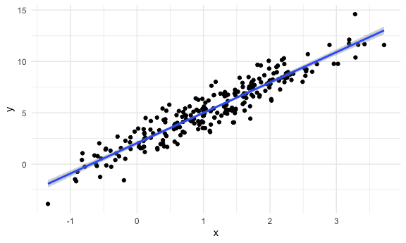
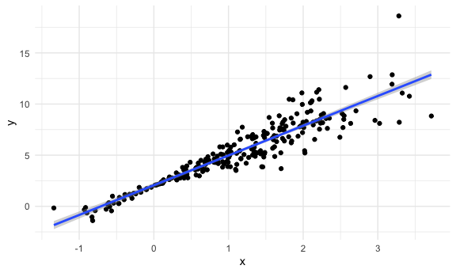
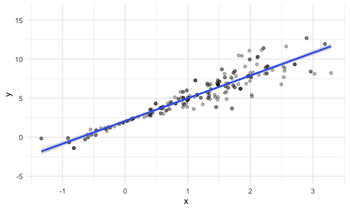

Bootstrapping
================
Jingyi Zhang

## Simulate data

``` r
n_samp = 250

sim_df_const =
  tibble(
    x = rnorm(n_samp, 1, 1),
    error = rnorm(n_samp, 0, 1),
    y = 2 + 3 * x + error
  )

sim_df_nonconst = 
  sim_df_const %>% 
  mutate(
    error = error * .75 * x,
    y = 2 + 3 * x + error
  )
```

Plot the datasets

``` r
sim_df_const %>% 
  ggplot(aes(x = x, y = y)) +
  geom_point() +
  geom_smooth(method = "lm")
```

    ## `geom_smooth()` using formula 'y ~ x'



``` r
sim_df_nonconst %>% 
  ggplot(aes(x = x, y = y)) +
  geom_point() +
  geom_smooth(method = "lm")
```

    ## `geom_smooth()` using formula 'y ~ x'



``` r
lm(y ~ x, data = sim_df_const) %>% broom::tidy()
```

    ## # A tibble: 2 x 5
    ##   term        estimate std.error statistic   p.value
    ##   <chr>          <dbl>     <dbl>     <dbl>     <dbl>
    ## 1 (Intercept)     2.05    0.0999      20.5 2.45e- 55
    ## 2 x               2.95    0.0687      43.0 7.46e-117

``` r
lm(y ~ x, data = sim_df_nonconst) %>% broom::tidy()
```

    ## # A tibble: 2 x 5
    ##   term        estimate std.error statistic   p.value
    ##   <chr>          <dbl>     <dbl>     <dbl>     <dbl>
    ## 1 (Intercept)     2.06    0.111       18.5 1.15e- 48
    ## 2 x               2.91    0.0766      38.0 2.45e-105

## Draw one bootstrap sample

``` r
boot_sample = function(df) {
  
  sample_frac(df, replace = TRUE) %>% 
    arrange(x)
  
}
```

Check if this works ..

``` r
# you get a different line each time -- generating bootstrap samples
boot_sample(sim_df_nonconst) %>%
  ggplot(aes(x = x, y = y)) +
  geom_point(alpha = .3) +
  geom_smooth(method = "lm") +
  ylim(-5, 16)
```

    ## `geom_smooth()` using formula 'y ~ x'

    ## Warning: Removed 1 rows containing non-finite values (stat_smooth).

    ## Warning: Removed 1 rows containing missing values (geom_point).



``` r
boot_sample(sim_df_nonconst) %>%
  lm(y ~ x, data = .) %>% 
  broom::tidy()
```

    ## # A tibble: 2 x 5
    ##   term        estimate std.error statistic   p.value
    ##   <chr>          <dbl>     <dbl>     <dbl>     <dbl>
    ## 1 (Intercept)     2.09    0.102       20.5 3.04e- 55
    ## 2 x               2.90    0.0698      41.5 1.25e-113
