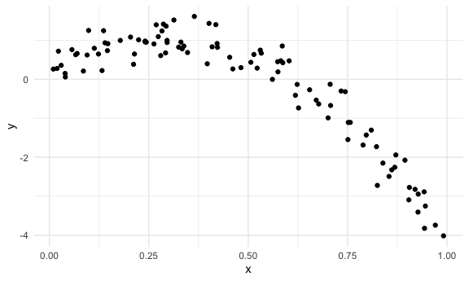

Cross Validation
================
Jingyi Zhang

## Simulate data

``` r
nonlin_df =
  tibble(
    id = 1:100,
    x = runif(100, 0, 1),
    y = 1 - 10 * (x - .3) ^ 2 + rnorm(100, 0, .3)
  )
```

Look at the data

``` r
nonlin_df %>% 
  ggplot(aes(x = x, y = y)) +
  geom_point()
```



## Cross validation – by hand

Get training and testing datasets

``` r
train_df = sample_n(nonlin_df, size = 80)
test_df = anti_join(nonlin_df, train_df, by = "id")
```

Fit three models.

``` r
linear_mod = lm(y ~ x, data = train_df)
smooth_mod = gam(y ~ s(x), data = train_df)
wiggly_mod = gam(y ~ s(x, k =30), sp = 10e-6, data = train_df)
```

Can I see what i just did?

linear model

``` r
train_df %>% 
  add_predictions(wiggly_mod) %>% 
  ggplot(aes(x = x, y = y)) +
  geom_point() +
  geom_line(aes(y = pred), color = "red")
```


``` r
train_df %>% 
  gather_predictions(linear_mod, smooth_mod, wiggly_mod) %>% 
  ggplot(aes(x = x, y = y)) +
  geom_point() +
  geom_line(aes(y = pred), color = "red") +
  facet_grid(. ~ model)
```


Look at prediction accuracy.

``` r
rmse(linear_mod, test_df)
```

    ## [1] 0.702876

``` r
rmse(smooth_mod, test_df)
```

    ## [1] 0.3258969

``` r
rmse(wiggly_mod, test_df)
```

    ## [1] 0.3224531

## Cross validation using `modelr`

``` r
# train and test side by side + id -- list columns
cv_df =
  crossv_mc(nonlin_df, 100)
```

What is happening here …

``` r
# R default stores as resample
cv_df %>% pull(train) %>% .[[1]] %>% as_tibble()
```

    ## # A tibble: 79 x 3
    ##       id      x       y
    ##    <int>  <dbl>   <dbl>
    ##  1     2 0.425   0.882 
    ##  2     3 0.650   0.255 
    ##  3     4 0.345   1.03  
    ##  4     6 0.185   0.643 
    ##  5     7 0.959  -2.66  
    ##  6     8 0.466   0.644 
    ##  7     9 0.876  -1.98  
    ##  8    11 0.0189 -0.0696
    ##  9    13 0.950  -3.22  
    ## 10    14 0.391   1.35  
    ## # … with 69 more rows

``` r
cv_df %>% pull(test) %>% .[[1]] %>% as_tibble()
```

    ## # A tibble: 21 x 3
    ##       id      x       y
    ##    <int>  <dbl>   <dbl>
    ##  1     1 0.807  -1.48  
    ##  2     5 0.610  -0.442 
    ##  3    10 0.246   1.05  
    ##  4    12 0.163   0.482 
    ##  5    22 0.0261 -0.0862
    ##  6    24 0.348   0.995 
    ##  7    25 0.0334  0.652 
    ##  8    42 0.121   1.10  
    ##  9    44 0.917  -3.31  
    ## 10    50 0.831  -1.62  
    ## # … with 11 more rows

``` r
# convert to tibble
cv_df =  
  cv_df %>% 
  mutate(
    train = map(train, as_tibble),
    test = map(test, as_tibble)
  )
```

Let’s try to fit models and get RMSEs for them.

``` r
cv_df =
  cv_df %>% 
  mutate(
    linear_mod = map(.x = train, ~lm(y ~ x, data = .x)),
    smooth_mod = map(.x = train, ~gam(y ~ s(x), data = .x)),
    wiggly_mod = map(.x = train, ~gam(y ~ s(x, k = 30), sp = 10e-6, data = .x))
  ) %>% 
  mutate(
    rmse_linear = map2_dbl(.x = linear_mod, .y = test, ~rmse(model = .x, data = .y)),
    rmse_smooth = map2_dbl(.x = smooth_mod, .y = test, ~rmse(model = .x, data = .y)),
    rmse_wiggly = map2_dbl(.x = wiggly_mod, .y = test, ~rmse(model = .x, data = .y))
  )
```

What do these results say about the model choices?

``` r
# smooth model is the best in this case
cv_df %>% 
  select(starts_with("rmse")) %>% 
  pivot_longer(
    everything(),
    names_to = "model",
    values_to = "rmse",
    names_prefix = "rmse_"
  ) %>% 
  ggplot(aes(x = model, y = rmse)) +
  geom_violin()
```


Compute averages …

``` r
cv_df %>% 
  select(starts_with("rmse")) %>% 
  pivot_longer(
    everything(),
    names_to = "model",
    values_to = "rmse",
    names_prefix = "rmse_"
  ) %>% 
  group_by(model) %>% 
  summarize(avg_rmse = mean(rmse))
```

    ## `summarise()` ungrouping output (override with `.groups` argument)

    ## # A tibble: 3 x 2
    ##   model  avg_rmse
    ##   <chr>     <dbl>
    ## 1 linear    0.786
    ## 2 smooth    0.293
    ## 3 wiggly    0.326
